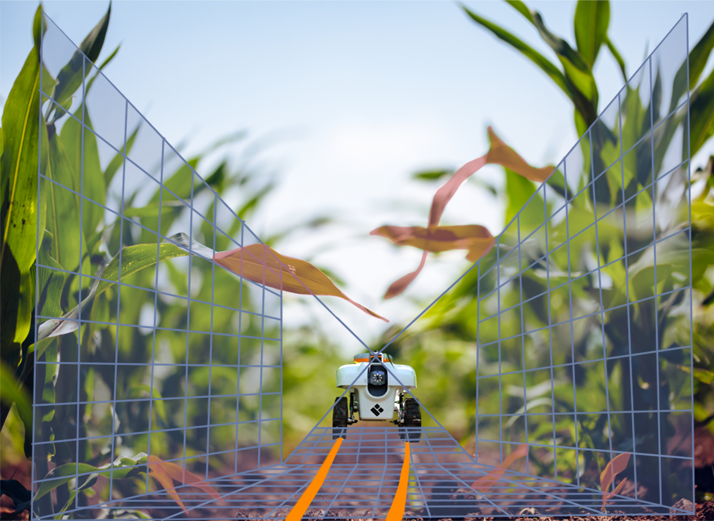

# CROW: A Self-Supervised Crop Row Navigation Algorithm for Agricultural Fields

<div style="text-align: center;">
    
</div>

## Overview

This repository provides an implementation of the paper:


> [**CROW: A Self-Supervised Crop Row Navigation Algorithm for Agricultural Fields**](),    
> Francisco Affonso, Felipe Andrade G. Tommaselli1, Gianluca Capezzuto,     
> Mateus V. Gasparino, Girish Chowdhary, Marcelo Becker,  
> *Paper at ?*  

We introduce CROW, a navigation system tailored for agricultural fields, specifically for operation under crop canopies. The system starts with a perception module that utilizes a self-supervised neural network to detect crop lines from LiDAR data. Using this information, waypoints are generated for a Model Predictive Controller (MPC), allowing the system to follow the crop lines and maintain its position on the reference path.

The code is organized into navigation modules, each accompanied by a brief explanation of how to use them individually and how to modify the parameters in the configuration files:

- **Inference:** LiDAR-Based Perception 
- **Wp_gen:** Waypoint Generator
- **Controllers:**
    - **NMPC:** Non-linear Model Predictive Controller solved using IPOPT 
    - **iLQR:** Non-linear Model Predictive Controller solved using Constrained iLQR


## Citation

If you find our work useful in your research, please consider citing our publication:

```bibtex
@inproceedings{affonso023navigating,
    title={Navigating with finesse: Leveraging neural network-based lidar perception and ilqr control for intelligent agriculture robotics},
    author={Pinto, Francisco Affonso and Tommaselli, Felipe Andrade G and Gasparino, Mateus V and Becker, Marcelo},
    booktitle={2023 Latin American Robotics Symposium (LARS), 2023 Brazilian Symposium on Robotics (SBR), and 2023 Workshop on Robotics in Education (WRE)},
    pages={502--507},
    year={2023},
    organization={IEEE}
}
```

## Instalation

The requirements are not strict hard requirements, but there may be some differences in performance or compatibility (not tested).

- Linux - Ubuntu 20.04
- ROS Noetic
- Python3
- CUDA

To install CasADi (an optimization framework), run:
```shell
source install_casadi.sh
```

To set up the environment needed:
```shell
# Create a virtual environment
python3 -m venv crow_env
source crow_env/bin/activate

# Install dependencies
pip3 install -r requirements.txt
```

If you prefer not to use a virtual environment, you can install the dependencies directly from `requirements.txt`.


## System Execution

This repository does not include the robot (TerraSentia) or the world environment (plantations) used in the paper. To run the code in a suitable environment, you will need a robot equipped with a 2D LiDAR. For the plantation environment, we recommend using the open-source repository [Virtual Maize Field](https://github.com/FieldRobotEvent/virtual_maize_field/tree/6896db468cec98af7a9a7ee83fdbb89a34da1816).

### Steps to Run the Code:

Once the environment is set up, follow these steps

1. **Run the perception node**:  
   Open a terminal and execute the following command:

   ```bash
   rosrun inference RTInference.py
   ```

2. **Run the waypoint generator and controller**
    
    In another terminal, run:

    ```
    roslaunch ilqr nav.launch
    ```

The system will begin controlling the robot towards the generated waypoints. You can visualize the process in RViz. If the waypoint generator or controller isn't performing robustly, you may need to adjust the parameters

#### Notes

- If you want to run the system without a suitable environment, you can proceed with the steps above as-is.
- The system's navigation modules can be customized through the respective config files, as previously mentioned.

## Experimental Results


## License

This code is released under the [MIT](https://opensource.org/license/mit) for academic usage.
