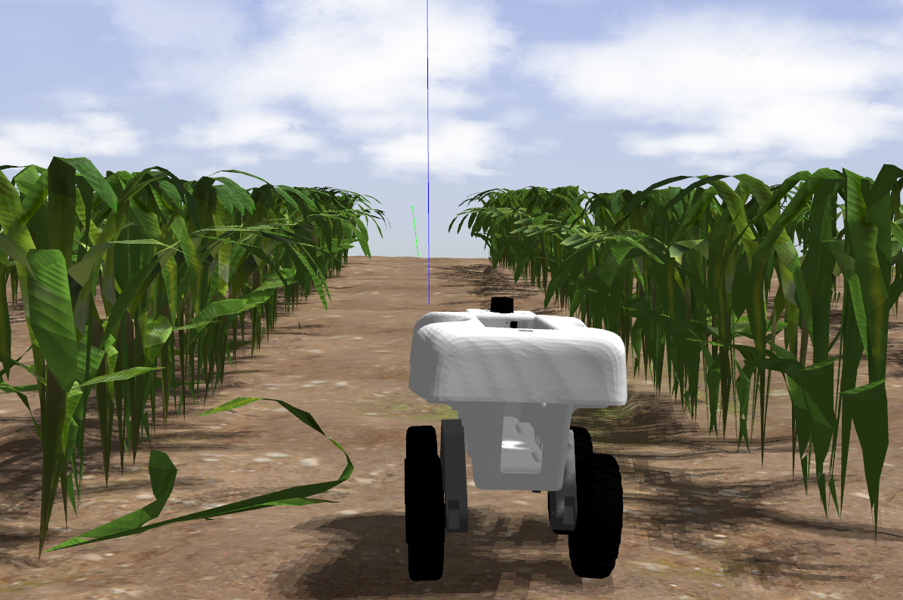
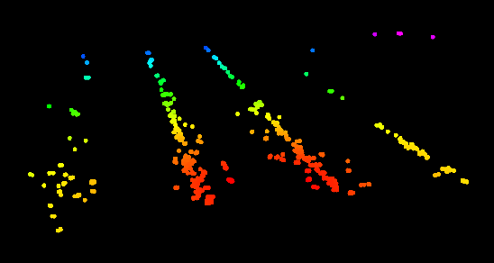
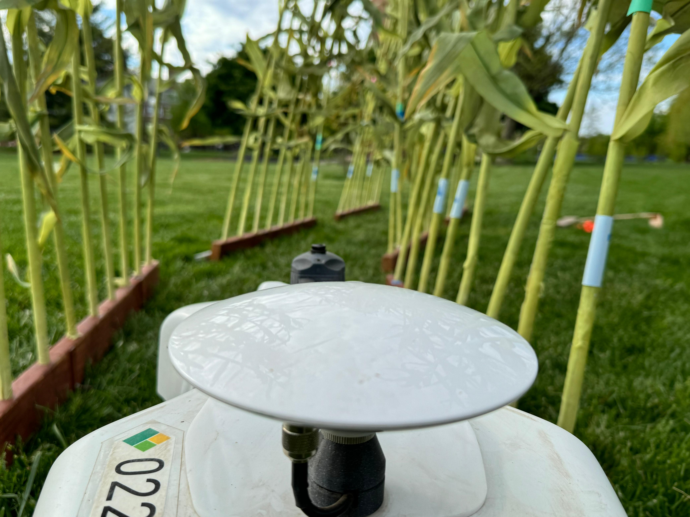
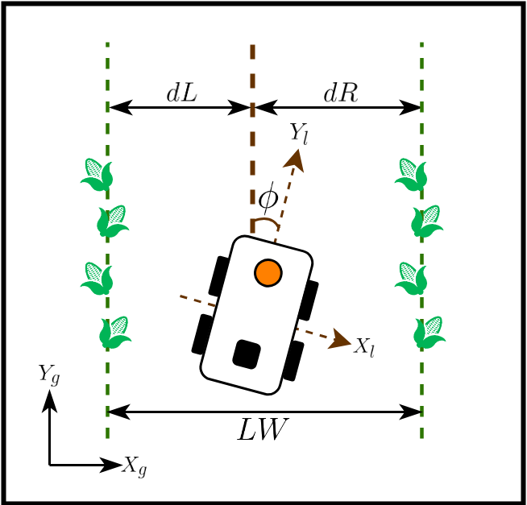
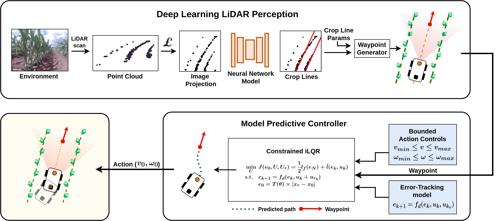
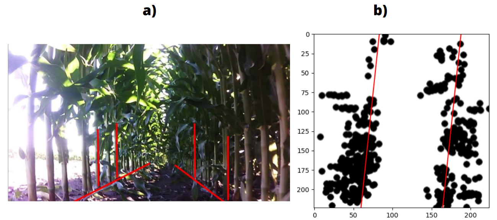
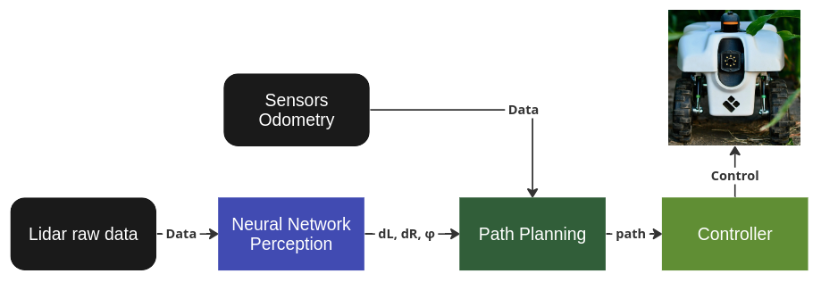
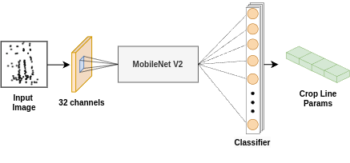
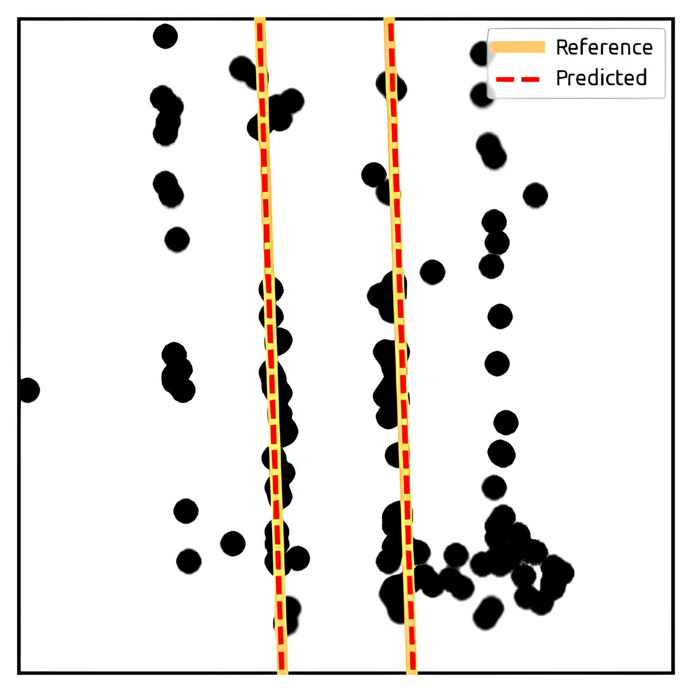
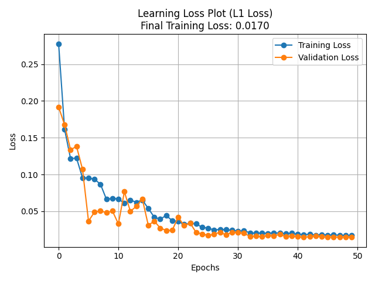

# Training Neural Network-Based Perception for TerraSentia

The initial approach identifies a perception system, in which the robot obtains information from the environment only through LiDAR, seeking alternatives for navigation without GNSS and without the use of a camera. In general, this approach, when achieving viable results, must be integrated into the TerraSentia platform, that is, the perception data must be loaded into a Path Planning algorithm and then into a Controller.




With the implemented approach, simulation results (using the Gazebo software) can generate system quality analyses. Furthermore, real tests with TerraSentia itself, as already carried out in the state of the art, will be able to measure the proposed alternative. With this, it is expected to expand the academic state of the art of land navigation, proving and comparing the viability of all technologies used.



> This project was supported by grants no. 2022/08330-9, São Paulo Research Foundation (FAPESP). The authors express his acknowledgments to EarthSense and Mobile Robotics Laboratory (LabRoM) from Engineering School of São Carlos (EESC-USP).


## Main Concepts

We present a system that is based on a generic agricultural environment, such as rows of corn plantations, but can be extended to systems with similar "corridor" characteristics, that is, those that have parallel boundaries on the sides. In this sense, the proposed system is based on the work of [1], who uses heuristic methods for perception by LiDAR. Inspired by this approach, the proposed system employs Deep Learning to solve the same problem. Additionally, in [2] it is presented, for the TerraSentia robot in a similar scenario, an implementation proposal based on sensory fusion.

In the proposed method, an approach based on Neural Networks is adopted to estimate the distance in relation to the lateral lines and the angle of rotation in relation to the straight line, from the LiDAR input data (which consist of 1081 points, covering an angle 270º with a resolution of 0.25º). The below figure visually represents the parameters of interest, including the distances *dL* and *dR*, as well as the azimuth *phi*.



As iLQR in the current implementation makes use of GNSS data, the system can support the use of Global coordinates (G), however, all perception is made in terms of relative to the robot (R). This guarantees modularity for "GNSS Denieded" implementations, that is, a scenario where global positioning signals are unreliable. By the figure below it is possible to verify the characterization of the data seen by LiDAR, in the figure on the right it is still possible to verify the labeling for the prediction.






For the perception task, a MobileNet V2 was used as an encoder with the final layers modified to meet the output of 4 values (from the equations of the line). It is noteworthy that in the end the data can be easily converted into *phi*, *dR* and *dL* from the equations of the lines that best model the problem.

A supervised learning technique was chosen for a prediction task with a total of 4000 manually classified images. To strengthen the network learning, a Transfer Learning technique through an artificial dataset, generated through a selected probability distribution, was employed. At this stage, approximately 10000 images entered the network, forming a base for the main model.



The approach based on images is due to the amount of **noise** in the input data, generated by the non-linearities of the scenario. This amount of noise is problematic for a good understanding of the network, so it was decided to apply a series of techniques for pre-processing the images.

> The current implementation does not consider temporal information itself, however, future implementations expect that temporal neural networks can be aggregated to avoid problems with obstacles and occlusion of LiDAR.

> **Note that the author already published the parcial results in the LARS 2023 [3]. DOI: 10.1109/LARS/SBR/WRE59448.2023.10332981**

## Parcial Results

At the moment, the system is in the process of training the network, with the following results:





| Indicators | Results |
|--------|-------|
| Last epoch error | 0.037 |
| Training time | 43min |
| Inference time | 32.77 ms |


## Hyperparameters

For reproducibility, the following hyperparameters were used:

| Network Training | Hyperparameters |
|--------|-------|
| Learning rate ($lr$) | 0.009 |
| Batch Size ($batch_size$) | 140 |
| Scheduler Step Size ($step\_size$) | 8 |
| Scheduler Gamma ($gamma$)  | 0.4 |
| Epochs ($epochs$) | 50 |
| Weight Decay ($weight\_decay$)| 0.0 |

The MobileNet V2 was used as an encoder, with the final layers modified to meet the output of 4 values (from the equations of the line). The optimizer used was Adam, with the parameters mentioned above. The loss function used was the L1 Loss.

## Dataset Generation Parameters

The above table displays the complete list of parameters used to generate the train and test datasets discussed in this work. The training dataset consists of 21,108 images, while the test dataset contains 11,440 images in total.

<table style="width:52%; margin:auto; border-collapse:collapse;">
  <caption></caption>
  <thead>
    <tr>
      <th>Parameter</th>
      <th>Train Dataset</th>
      <th>Test Dataset</th>
    </tr>
  </thead>
  <tbody>
    <tr><td>RANGE_1</td><td>-25</td><td>-25</td></tr>
    <tr><td>RANGE_2</td><td>26</td><td>26</td></tr>
    <tr><td>STEP</td><td>1</td><td>1</td></tr>
    <tr><td>BOUND_1</td><td>400</td><td>300</td></tr>
    <tr><td>BOUND_2</td><td>600</td><td>350</td></tr>
    <tr><td>DIVIDER_1a</td><td>30</td><td>40</td></tr>
    <tr><td>DIVIDER_1b</td><td>50</td><td>60</td></tr>
    <tr><td>DIVIDER_2a</td><td>35</td><td>50</td></tr>
    <tr><td>DIVIDER_2b</td><td>60</td><td>80</td></tr>
    <tr><td>DIVIDER_LIM</td><td>100</td><td>100</td></tr>
    <tr><td>DB_D1a</td><td>30</td><td>50</td></tr>
    <tr><td>DB_D1b</td><td>70</td><td>80</td></tr>
    <tr><td>DB_D2a</td><td>30</td><td>50</td></tr>
    <tr><td>DB_D2b</td><td>70</td><td>70</td></tr>
    <tr><td>DB_BOUND1</td><td>5</td><td>5</td></tr>
    <tr><td>DB_BOUND2</td><td>7</td><td>7</td></tr>
    <tr><td>DB_RANGE1</td><td>image_size//15</td><td>image_size//15</td></tr>
    <tr><td>DB_RANGE2</td><td>(6*image_size)//10</td><td>(6*image_size)//10</td></tr>
    <tr><td>DB_COLOR</td><td>black</td><td>black</td></tr>
    <tr><td>DT_CLUST1</td><td>4</td><td>4</td></tr>
    <tr><td>DT_CLUST2</td><td>15</td><td>22</td></tr>
    <tr><td>DT_POINTS</td><td>2</td><td>2</td></tr>
    <tr><td>DT_BOUND1</td><td>2</td><td>2</td></tr>
    <tr><td>DT_BOUND2</td><td>10</td><td>10</td></tr>
    <tr><td>DT_RANGE1</td><td>2*image_size//3</td><td>2*image_size//3</td></tr>
    <tr><td>DT_RANGE2</td><td>image_size</td><td>image_size</td></tr>
    <tr><td>DT_COLOR</td><td>black</td><td>black</td></tr>
    <tr><td>F1_CLUST1</td><td>3</td><td>5</td></tr>
    <tr><td>F1_CLUST2</td><td>10</td><td>18</td></tr>
    <tr><td>F1_POINTS</td><td>3</td><td>4</td></tr>
    <tr><td>F1_BOUND1</td><td>8</td><td>8</td></tr>
    <tr><td>F1_BOUND2</td><td>18</td><td>18</td></tr>
    <tr><td>F1_RANGE1</td><td>(image_size//8)</td><td>0</td></tr>
    <tr><td>F1_RANGE2</td><td>(image_size//5)</td><td>(image_size//5)</td></tr>
    <tr><td>F1_COLOR</td><td>black</td><td>black</td></tr>
    <tr><td>F2_CLUST1</td><td>1</td><td>1</td></tr>
    <tr><td>F2_CLUST2</td><td>4</td><td>4</td></tr>
    <tr><td>F2_POINTS</td><td>5</td><td>5</td></tr>
    <tr><td>F2_BOUND1</td><td>50</td><td>50</td></tr>
    <tr><td>F2_BOUND2</td><td>51</td><td>51</td></tr>
    <tr><td>F2_CENTRAL1</td><td>image_size//12</td><td>image_size//12</td></tr>
    <tr><td>F2_CENTRAL2</td><td>image_size//5</td><td>image_size//5</td></tr>
    <tr><td>F2_COLOR</td><td>black</td><td>black</td></tr>
    <tr><td>FC_LIM</td><td>20</td><td>15</td></tr>
    <tr><td>FC_D1a</td><td>3</td><td>20</td></tr>
    <tr><td>FC_D1b</td><td>50</td><td>75</td></tr>
    <tr><td>FC_D2a</td><td>3</td><td>15</td></tr>
    <tr><td>FC_D2b</td><td>40</td><td>55</td></tr>
    <tr><td>FC_BOUND1</td><td>30</td><td>30</td></tr>
    <tr><td>FC_BOUND2</td><td>35</td><td>35</td></tr>
    <tr><td>FC_RANGE1</td><td>image_size//6</td><td>image_size//6</td></tr>
    <tr><td>FC_RANGE2</td><td>image_size</td><td>image_size</td></tr>
    <tr><td>FC_COLOR</td><td>black</td><td>black</td></tr>
    <tr><td>RND_RANGE1</td><td>0</td><td>0</td></tr>
    <tr><td>RND_RANGE2</td><td>30</td><td>40</td></tr>
    <tr><td>RND_COLOR</td><td>black</td><td>black</td></tr>
  </tbody>
</table>


**The full understanding of the parameters usage can be best comprehended in the Scripts section, following the indications.** For now, some intuitions can be extracted to better characterize these datasets by analyzing the parameters with similar functions. Each prefix in the table corresponds to one of the nuclei sections in Paper explanation. The full relation is:

- **DB (Data Bottom):**  
  This region, indicated by the black area in **Fig. \ref{fig:ADColors}**, is referred to as "Data" since it serves as the primary source of information for inference. The reference lines (in red) are located within this area, and points tend to cluster around them.

- **DT (Data Top):**  
  This parameter refers to the data at the top of the image, specifically the gray region, which behaves similarly to DB, as points tend to accumulate as residuals from the main lines. The data typically originates from distant points, such as those in the center of the row (e.g., leaves). Although this data is often not very useful, there is some correlation between these points and the main lines. Generally, this region can be viewed as noise distortion that deviates from the DB region.

- **F1 (Foreground 1):**  
  This parameter refers to the distortion (noise) at the bottom of the image, highlighted as the orange region in **Fig. \ref{fig:ADColors}**. This area is termed "Foreground" due to the accumulation of points near the LiDAR. Points in this region may originate from various sources, such as the robot's parts near the LiDAR or leaves close to the center of the lane. Typically, this data is not useful for inference.

- **F2 (Foreground 2):**  
  This is the second type of Foreground distortion. The primary concept behind F1 and F2 is to ensure the region is as heterogeneous as possible, with these two subregions overlapping.

- **FC (Far Center):**  
  This region refers to the adjacent green lines. The "Far Center" notation is noteworthy due to the variety of shapes these lines can take. When the robot approaches the limit angles, these lines may exhibit significant distortion.

- **RND (Random):**  
  The final parameter family defines the Random Noise distributed across the entire image, with its key contribution being the abstraction resulting from data degeneration.


The **suffix list** categorizes parameters into distinct groups, which can be divided as follows:

- **RANGE:**  
  This parameter suffix represents ranges in general, usually from `RANGE1` to `RANGE2`. In most cases, these parameters are used to delimit the Y-axis region.

- **BOUND:**  
  This suffix determines the region boundaries used to create the delimiter for the distribution.

- **CLUSTER:**  
  This parameter family generates a clustering effect using the Normal Distribution Function, where the number of points in each cluster is normally distributed around the cluster center. The goal is to create small clusters of points that simulate a LiDAR reading.

- **LIM:**  
  This suffix is employed when plotting adjacent lines within the green area of the flowchart (FC). The `LIM` parameter denotes the threshold characterizing the degree of inclination permissible for the lines to influence point placement. When the lines exhibit significant inclination, the adjacent lines on the inclined side become suppressed, requiring the boundaries on the opposing side to expand accordingly.

- **COLOR:**  
  The `COLOR` parameter family changes the plot color for better region visualization, primarily for debugging purposes.


## Installation

### Dependencies

> Please note that the following dependencies are required only for training the perception module. For the complete project setup, refer to the full documentation.

``` shell
sudo apt install python3.8
sudo apt install python3-pip
```

```
pip install --upgrade setuptools
```

``` shell
pip install customtkinter==5.1.2 matplotlib==3.7.1 numpy==1.24.2 pandas==2.0.0 Pillow==9.5.0 scikit_learn==1.2.2 scipy==1.10.1 torchsummary==1.5.1 torchvision==0.15.1 colorful==0.5.5
```

> Torch install depends on your CUDA version, check the [official website](https://pytorch.org/get-started/locally/) for more information.


Old versions also require "opencv-contrib", try running without it first. 

``` shell
pip install opencv-contrib-python==4.7.0
```

> Download the dataset from google drive or generate your own dataset

### Run

``` shell
cd src
python3 main.py
```

## References

### Cited in the text

    [1] V. A. Higuti, A. E. Velasquez, D. V. Magalhaes, M. Becker, and G. Chowdhary, “Under canopy light detection and ranging-based
    autonomous navigation,” Journal of Field Robotics, vol. 36, no. 3, pp. 547–567, 2019.

    [2] A. E. B. Velasquez, V. A. H. Higuti, M. V. Gasparino, A. N. Sivakumar, M. Becker, and G. Chowdhary, “Multi-sensor fusion based
    robust row following for compact agricultural robots,” arXiv preprint arXiv:2106.15029, 2021.

    [3] F. A. Pinto, F. Tommaselli, M. V. Gasparino, and M. Becker, “Navigating with finesse: Leveraging neural network-based lidar perception and ilqr control for intelligent agriculture robotics,” in SBR-LARS 2023, oct 2023

### Others

    [4] M. V. Gasparino, V. A. Higuti, A. E. Velasquez, and M. Becker, “Improved localization in a corn crop row using a rotated laser  rangefinder for three-dimensional data acquisition,” Journal of the Brazilian Society of Mechanical Sciences and Engineering, vol. 42, no. 11, pp. 1–10, 2020.

    [5] M. V. Gasparino, V. A. Higuti, A. N. Sivakumar, A. E. Velasquez, M. Becker, and G. Chowdhary, “Cropnav: a framework for autonomous navigation in real farms,” in 2023 IEEE International Conference on Robotics and Automation (ICRA). IEEE, 2023, pp. 11 824–11 830.

    [6] R. Ravi, Y.-J. Lin, T. Shamseldin, M. Elbahnasawy, A. Masjedi,M. Crawford, and A. Habib, “Wheel-based lidar data for plant height and canopy cover evaluation to aid biomass prediction,” in IGARSS 2018 - 2018 IEEE International Geoscience and Remote Sensing Symposium, 2018, pp. 3242–3245.

    [7] Q. Ge, Q. Sun, S. E. Li, S. Zheng, W. Wu, and X. Chen, “Numerically stable dynamic bicycle model for discrete-time control,” in 2021 IEEE Intelligent Vehicles Symposium Workshops (IV Workshops), 2021, pp.
    128–134.

    [8] J. Aulinas, Y. Petillot, J. Salvi, and X. Llad ́o, “The slam problem: a survey,” Artificial Intelligence Research and Development, pp. 363371, 2008.

    [9] P. Heroux, “Principles of gnss, inertial, and multisensor integrated navigation systems.” Geomatica, vol. 62, no. 2, pp. 207–209, 2008.

    [10] J. P. Hespanha, “Lqg/lqr controller design,” Undergraduate Lecture Notes, University of California, Santa Barbara, California, USA, 2007.

    [11] K. Holkar and L. M. Waghmare, “An overview of model predictive control,” International Journal of control and automation, vol. 3, no. 4, pp. 47–63, 2010.

    [12] E. Kayacan and G. Chowdhary, “Tracking error learning control for precise mobile robot path tracking in outdoor environment,” CoRR, vol. abs/2103.11282, 2021.
